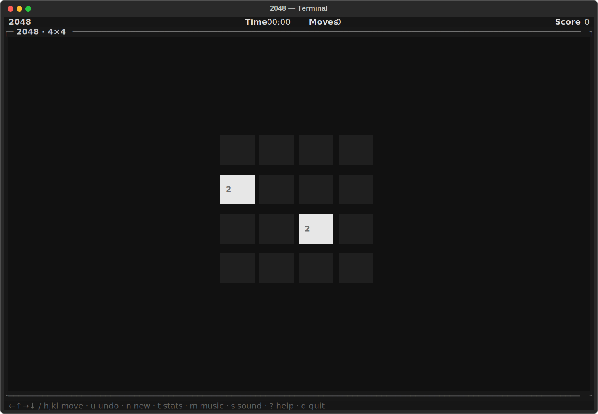
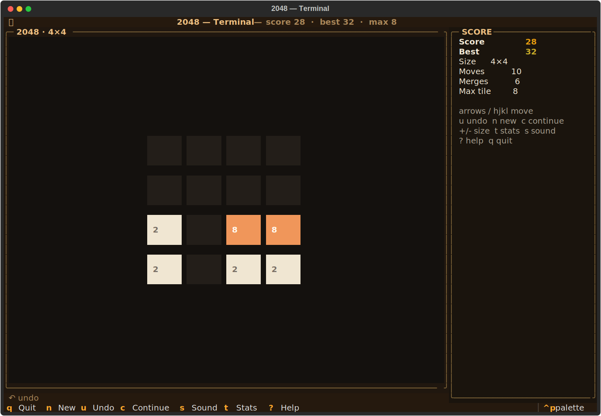
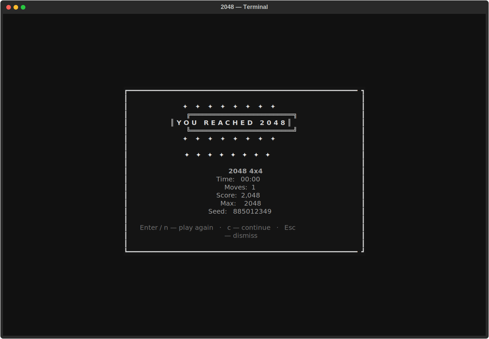

# 2048-tui
Chase the tile. Chase the dream.





## About
Terminal 2048 with board sizes 3x3 through 6x6, undo, autosave/resume, stats modal, celebration/game-over screens, and optional music + sound effects.

## Install & Run
```bash
git clone https://github.com/akakabrian/2048-tui
cd 2048-tui
make
make run
```

Start with music on:
```bash
make run ARGS="--music"
```

Run quiet (no SFX):
```bash
make run ARGS="--no-sound"
```

## Updating
```bash
cd 2048-tui
make update
make run
```

## Controls
| Key | Action |
|-----|--------|
| `←` `→` `↑` `↓` / `h` `j` `k` `l` | move |
| `u` | undo |
| `n` | new game |
| `c` | continue after reaching 2048 |
| `t` | stats modal |
| `r` | rules modal |
| `m` | toggle background music |
| `s` | toggle sound effects |
| `+` / `-` | board size up/down (3..6) |
| `?` | help |
| `q` | quit |

## Music credits
Shipped tracks (`twenty48_tui/assets/music/`):
- *Happy* — Alex McCulloch (CC0 1.0)
- *Easy Lemon* — Kevin MacLeod (incompetech.com), [CC-BY 4.0](https://creativecommons.org/licenses/by/4.0/)
- *Fluffing a Duck* — Kevin MacLeod (incompetech.com), [CC-BY 4.0](https://creativecommons.org/licenses/by/4.0/)

## Testing
```bash
make test
make playtest
make perf
```

## License
MIT
